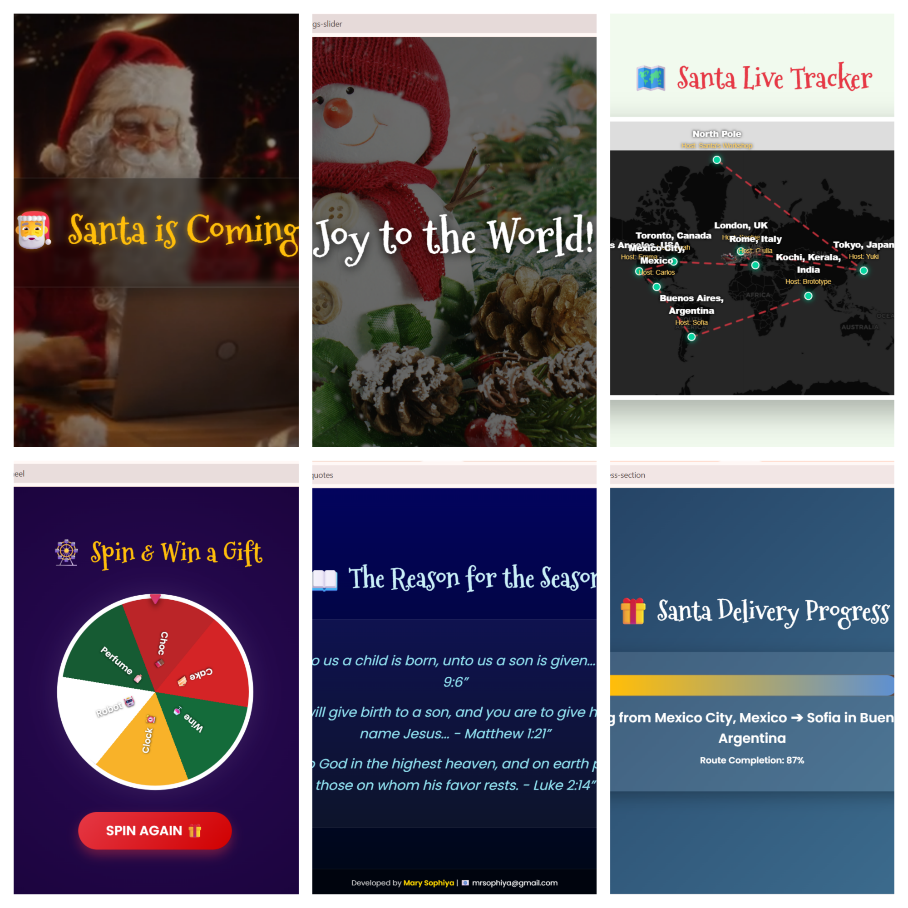

# 🎅 Santa is Coming - The Ultimate Christmas Companion 🎄

**Happy Christmas!** May your holidays be filled with joy and code! ✨

This application was lovingly developed for the **Brototype Santakkoru Christmas Online Hackathon**. It is designed to bring the magic of Santa's journey to life on your screen.

## 🌟 Services & Features

### 1. 🌍 **Live Santa Tracker**
Watch Santa move in real-time across a detailed, dark-themed interactive map!
- **Real-World Route**: Tracks the journey from the North Pole to cities like Tokyo, Delhi, London, and New York.
- **Personalized Delivery**: See exactly *who* Santa is delivering to (Hosting names like Yuki, Aarav, Sophie) displayed directly on the map.
- **Infinite Loop**: The journey never ends! Santa flies continuously to spread joy.

### 2. 🎁 **Santa's Gift Wheel**
Feeling lucky? Spin the festive wheel to reveal your Christmas surprise!
- **Real Prizes**: Win virtual Cake 🍰, Wine 🍷, Robots 🤖, and more.
- **Christmas Theme**: A beautifully designed wheel with holiday colors (Red, Green, Gold).

### 3. 💌 **Festive Greetings**
A beautiful, auto-playing slider showcasing heartwarming Christmas messages to brighten your day.

### 4. 📖 **The Bible Connection**
A dedicated section displaying meaningful Bible quotes related to the birth of Jesus, grounding the celebration in its origins.

---

## 🛠️ Technology Stack

We used modern, lightweight web technologies to ensure a smooth and beautiful experience:

- **HTML5**: Semantic structure for accessibility.
- **CSS3**:
    - **Glassmorphism**: Premium frosted-glass effects.
    - **Animations**: Smooth transitions and CSS-only aesthetics.
    - **Responsive Design**: Looks great on Mobile & Desktop.
- **JavaScript (ES6+)**:
    - **Leaflet.js**: Powerful interactive mapping engine.
    - **Animation Loop**: Custom `requestAnimationFrame` for buttery smooth Santa movement.
    - **Logic**: Dynamic DOM manipulation for the wheel and slider.
- **Google Fonts**: "Mountains of Christmas" & "Poppins" for that festive feel.

---

## 🚀 How to Use

### 🟢 Run Online (GitHub Pages)
If this is hosted on GitHub, simply go to your repository **Settings > Pages** and enable it. The site will work for everyone instantly!

### 🟠 Run Locally
Due to browser security (CORS), you cannot just double-click `index.html`.
1.  **Open Terminal** in the project folder.
2.  **Run**: `python -m http.server 8000` (or use VS Code Live Server).
3.  **Visit**: `http://localhost:8000`

## 📸 Screenshots

---

## 👨‍� Developer Notes
- **Map Data**: All coordinates are stored in `data/locations.json`.
- **Customization**: You can add more cities or change prizes easily by editing the JSON or JS arrays.

**Merry Christmas & Happy Coding! 🚀**
*Developed by a proud Brototype Learner Mary Sophiya*
